# Hyprland Dotfiles

<p align="center">
  
  
  
  
</p>

A beautiful and feature-rich Hyprland configuration for Arch Linux with intelligent theme management that automatically syncs colors across your entire system.

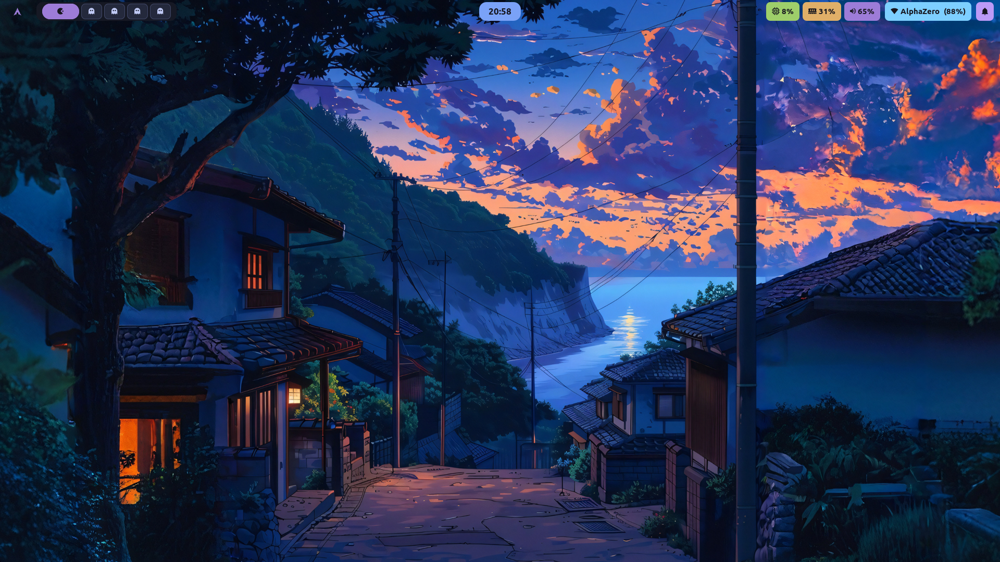

---

## Features

**Intelligent Theme System**
- Dynamic theme switching with a single command
- Automatic color synchronization across all applications
- Neovim automatically syncs colors with the active system theme
- 8 carefully curated color schemes included
- Auto-discovery of custom themes
- Validation and error checking for theme files

**Supported Applications**
- Hyprland (window borders and shadows)
- Waybar (status bar)
- Rofi (application launcher and powermenu)
- Rofi (application launcher)
- Starship (shell prompt)
- Kitty & Alacritty (terminals)
- SwayNC (notifications)
- Btop (system monitor)
- Cava (audio visualizer)

**Development Environment**
- Neovim with LSP, Treesitter, and modern plugins
- Automatic Neovim colorscheme syncing with the theme switcher
- Optimized keybindings for productivity
- GPU-accelerated terminals

**System Management**
- Automatic configuration backups (keeps last 5)
- Detailed logging for troubleshooting
- Modular configuration structure
- Easy rollback capabilities

---

## Available Themes

- **Catppuccin Mocha** 
- **Catppuccin Latte** 
- **Tokyo Night**
- **Dracula** 
- **Rose Pine**
- **Gruvbox** 
- **Nord** 
- **One Dark** 

---

## Requirements

- Arch Linux (or Arch-based distribution)
- Git
- AUR helper (yay or paru - installed automatically if missing)

---

## Installation

### Quick Install

```bash
git clone https://github.com/AnanyTanwar/hyprland-dotfiles.git
cd hyprland-dotfiles
chmod +x install.sh
./install.sh
```

The installation script will:
- Install all required packages and dependencies
- Install Nerd Fonts (JetBrains Mono, FiraCode, Meslo)
- Backup existing configurations with timestamp
- Create symlinks to the dotfiles
- Set up the theme switcher
- Install theme-matched wallpapers to ~/Pictures/Wallpapers

After installation, log out and log back in to apply all changes.

### Manual Installation

For manual installation instructions, see the [Manual Installation Guide](docs/MANUAL_INSTALL.md).

---

## Theme Management

### Switching Themes

Run the theme switcher:
```bash
~/.config/theme-switcher/scripts/switcher.sh
```

Or use the keybinding: `SUPER + T`

### Command Line Options

```bash
# Show interactive menu (default)
switcher.sh

# Apply specific theme
switcher.sh apply tokyo-night

# List available themes
switcher.sh list

# Show current theme
switcher.sh current

# Show help
switcher.sh help
```

### Theme Generator

```bash
# List available palettes
generate-themes.py -l

# Validate all palettes
generate-themes.py --validate

# Generate specific theme
generate-themes.py -t dracula

# Verbose output
generate-themes.py -v
```

### Creating Custom Themes

1. Create a JSON palette in `config/theme-switcher/palettes/`:

```json
{
  "name": "my-theme",
  "base": "#1e1e2e",
  "text": "#cdd6f4",
  "red": "#f38ba8",
  "green": "#a6e3a1",
  "yellow": "#f9e2af",
  "blue": "#89b4fa",
  "pink": "#f5c2e7"
}
```

2. Generate the theme:
```bash
~/.config/theme-switcher/scripts/generate-themes.py
```

Your theme will automatically appear in the theme switcher.

---

## Keybindings

### Essential Shortcuts

| Keybind | Action |
|---------|--------|
| `SUPER + Q` | Close window |
| `SUPER + Return` | Open terminal |
| `SUPER + D` | Application launcher |
| `SUPER + T` | Theme switcher |
| `SUPER + E` | File manager |
| `SUPER + V` | Toggle floating |
| `SUPER + F` | Toggle fullscreen |
| `SUPER + [1-9]` | Switch workspace |
| `SUPER + SHIFT + [1-9]` | Move window to workspace |

Complete keybinding reference: `config/hypr/config/keybinds.conf`

---

## Configuration Structure

```
hyprland-dotfiles/
├── config/
│   ├── hypr/
│   │   ├── hyprland.conf
│   │   ├── hyprlock.conf
│   │   ├── config/           # Modular configuration
│   │   │   ├── animations.conf
│   │   │   ├── appearance.conf
│   │   │   ├── keybinds.conf
│   │   │   ├── monitors.conf
│   │   │   ├── programs.conf
│   │   │   ├── windowrules.conf
│   │   │   └── workspaces.conf
│   │   └── scripts/          # Utility scripts
│   ├── theme-switcher/
│   │   ├── palettes/         # JSON color definitions
│   │   ├── themes/           # Generated theme files
│   │   └── scripts/
│   │       ├── generate-themes.py
│   │       └── switcher.sh
│   ├── waybar/
│   ├── rofi/
│   ├── kitty/
│   ├── alacritty/
│   ├── swaync/
│   ├── nvim/
│   ├── btop/
│   ├── cava/
│   └── starship/
├── .zshrc
├── install.sh
└── README.md
```

---

## Customization

### Hyprland Configuration

All Hyprland settings are modular and easy to customize:

- `config/animations.conf` - Animation timing and curves
- `config/appearance.conf` - Visual settings (borders, gaps, rounding)
- `config/keybinds.conf` - Keyboard shortcuts
- `config/monitors.conf` - Display configuration
- `config/programs.conf` - Default applications
- `config/windowrules.conf` - Application-specific rules
- `config/workspaces.conf` - Workspace behavior

### Starship Prompt

Edit `~/.config/starship/starship.toml` to customize your prompt.
Colors are automatically synchronized with the active theme.

---

## Troubleshooting

**Scripts not executing**
```bash
chmod +x ~/.config/theme-switcher/scripts/*.sh
chmod +x ~/.config/hypr/scripts/*.sh
```

**Waybar not visible**
```bash
pkill waybar && waybar &
```

**Missing icons**
```bash
yay -S ttf-jetbrains-mono-nerd ttf-firacode-nerd
```

**Theme not applying**
```bash
# Check logs
cat ~/.config/theme-switcher/.theme-switcher.log

# Regenerate themes
~/.config/theme-switcher/scripts/generate-themes.py -v

# Reapply current theme
~/.config/theme-switcher/scripts/switcher.sh apply $(cat ~/.config/theme-switcher/.current-theme)
```

---

## Screenshots

### Tokyo Night

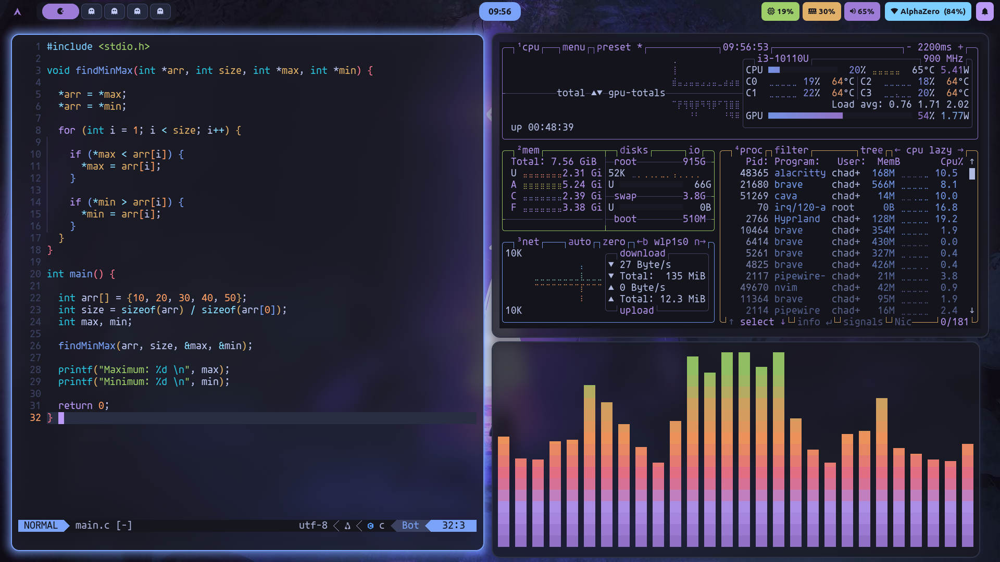

### Catppuccin
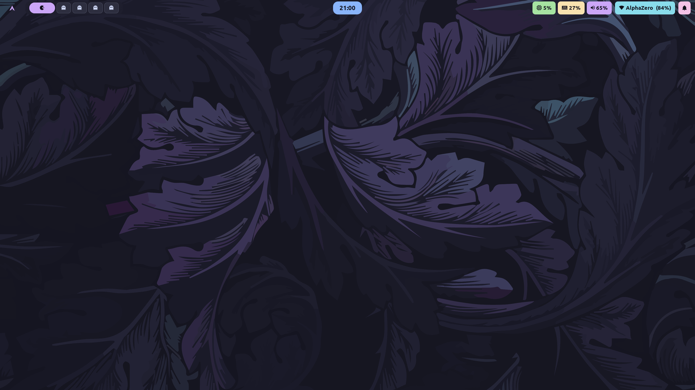
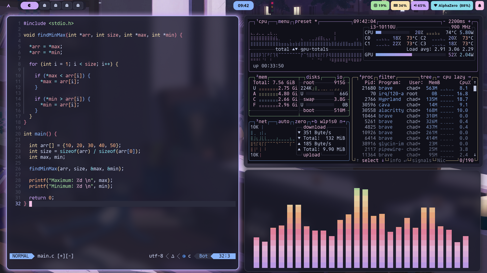

### Gruvbox
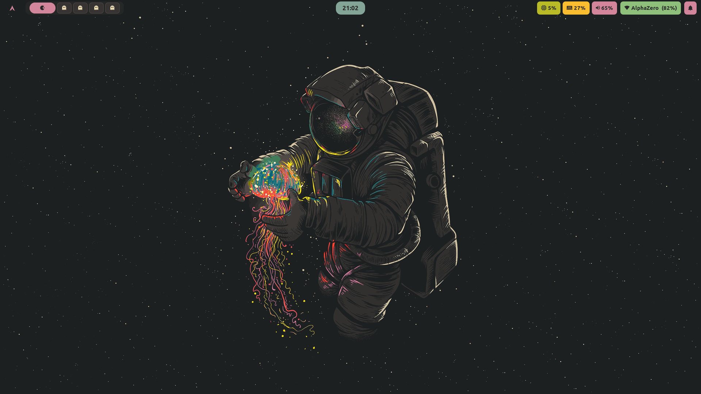
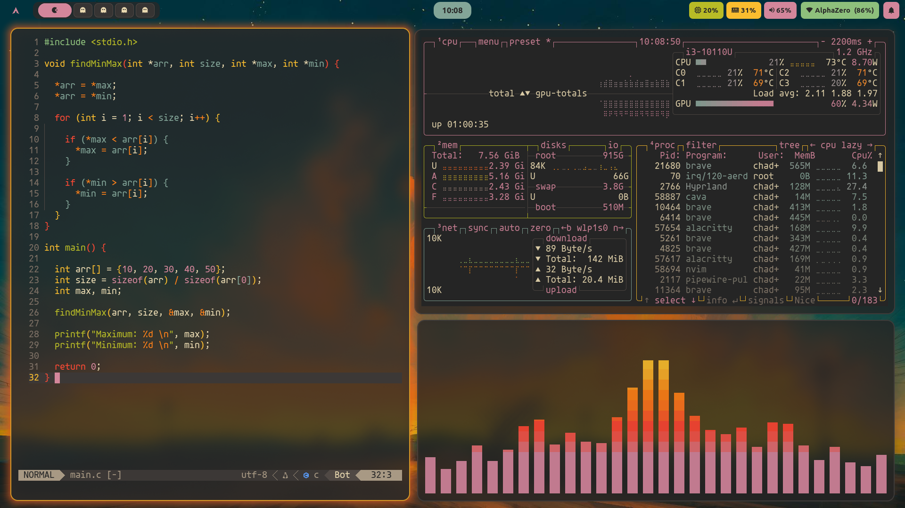

### Dracula
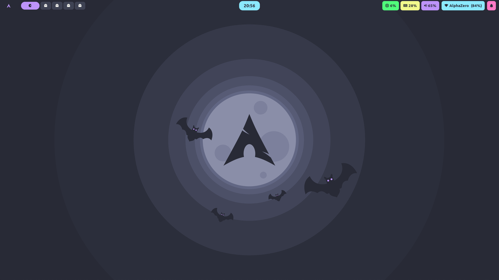


### Rosé Pine
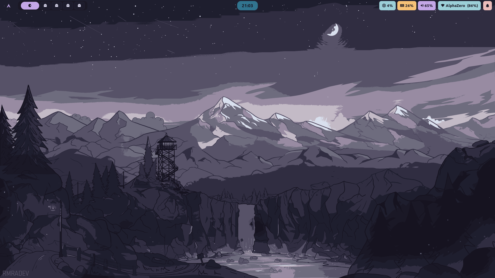
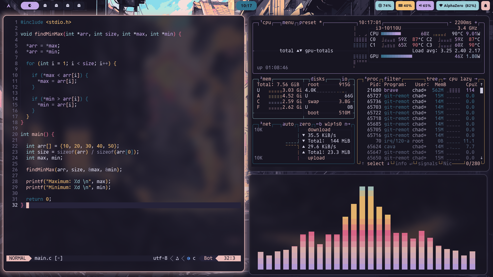

### Nord
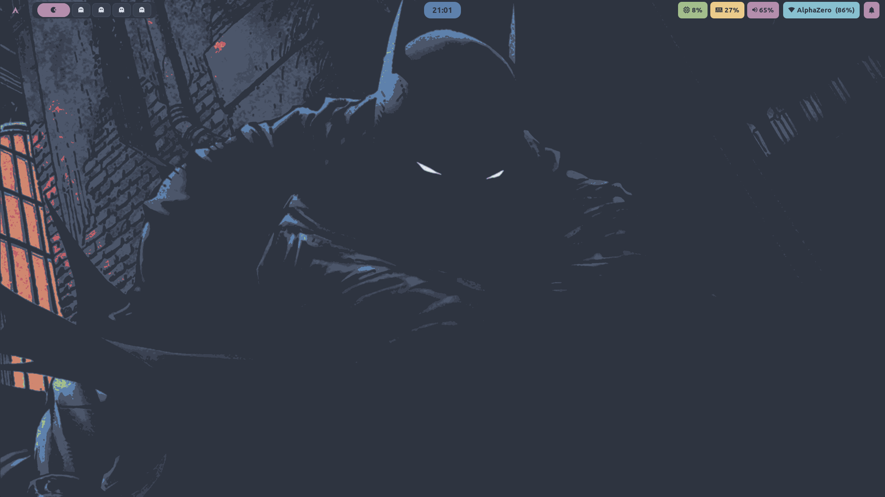
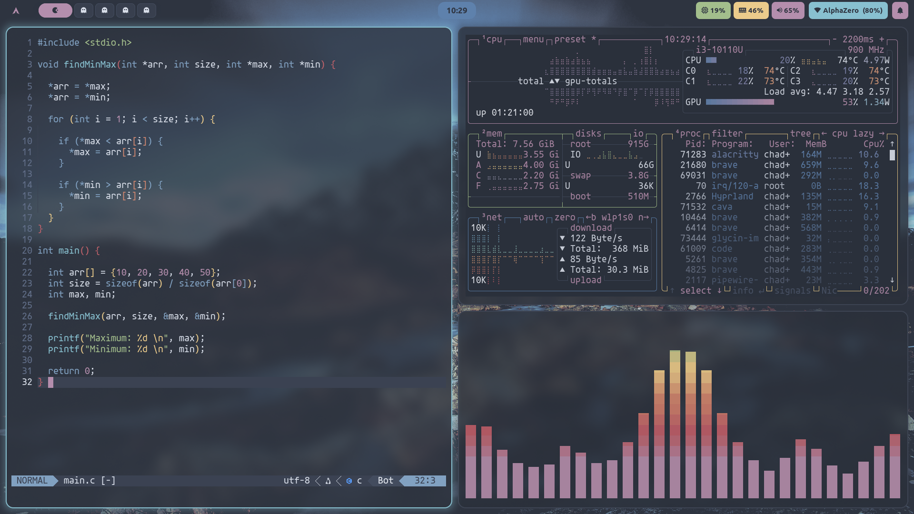

---

## Roadmap

- GTK theme integration
- Wallpaper manager with theme-matched wallpapers
- Firefox theme synchronization
- Additional color schemes
- Theme import/export functionality

---

## Credits

**Themes**
- [Catppuccin](https://github.com/catppuccin/catppuccin)
- [Tokyo Night](https://github.com/tokyo-night/tokyo-night-vscode-theme)
- [Dracula](https://draculatheme.com/)
- [Rose Pine](https://rosepinetheme.com/)
- [Gruvbox](https://github.com/morhetz/gruvbox)
- [Nord](https://www.nordtheme.com/)

**Software**
- [Hyprland](https://hyprland.org/) - Wayland compositor
- The Hyprland community for inspiration

---

## License

MIT License - see [LICENSE](LICENSE) file for details.

## Contributing

Issues and pull requests are welcome. For major changes, please open an issue first to discuss proposed changes.

---

**Made by [Anany Tanwar](https://github.com/AnanyTanwar)**

If you find this useful, consider giving it a star ⭐
